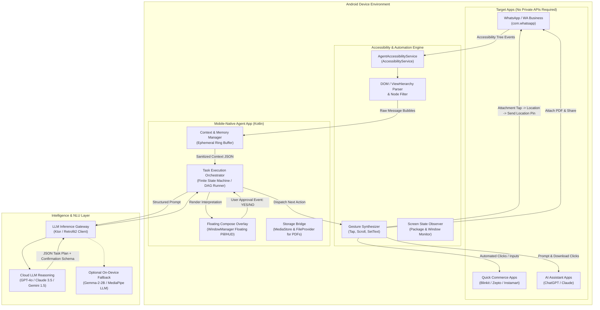
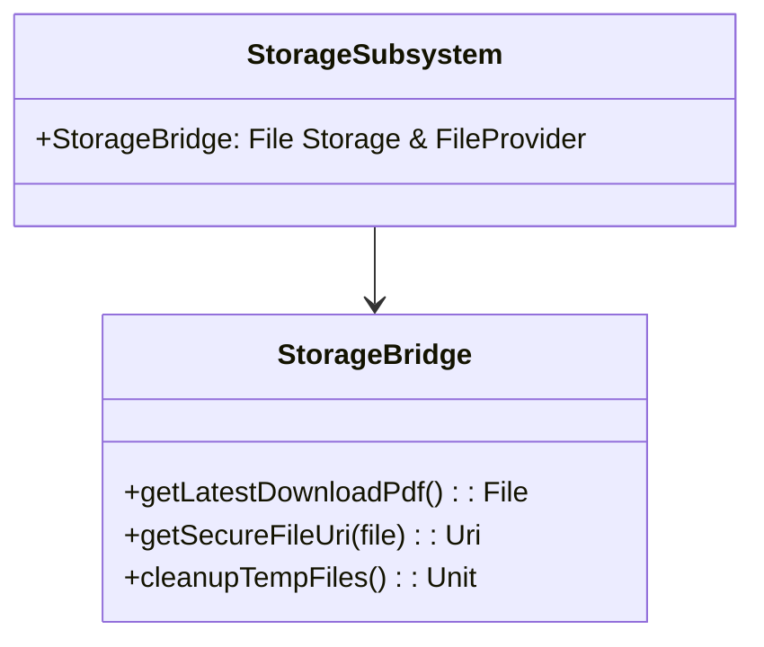
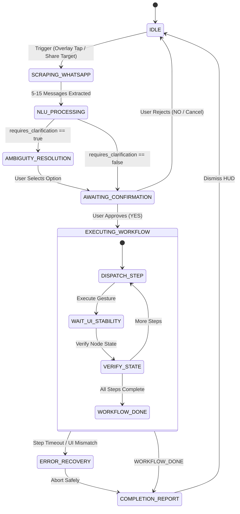
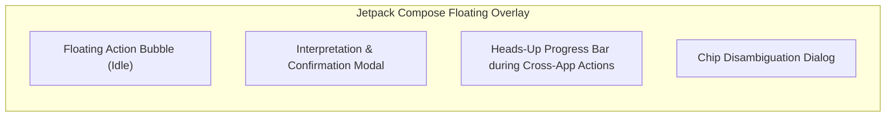

# Mobile-Native Conversational Agent: Deep Technical Stack & Engineering Specification

> **Architectural Blueprint and Technical Stack Specification for Android-Native Autonomous Cross-Application Agents**  
> *Target Platform: Android (API 26 to API 35+) | Core Language: Kotlin | Execution Engine: Android Accessibility Services + Intents + Cloud/Edge LLMs*

---

## Table of Contents

1. [System Architecture & Data Flow](#1-system-architecture--data-flow)
2. [Android Subsystem & Core Application Architecture](#2-android-subsystem--core-application-architecture)
3. [Accessibility Service & UI Automation Engine](#3-accessibility-service--ui-automation-engine)
4. [App-Specific Automation & UI Drivers](#4-app-specific-automation--ui-drivers)
   - [4.1 WhatsApp Scraping & Messaging Driver](#41-whatsapp-scraping--messaging-driver)
   - [4.2 Quick-Commerce & Shopping Driver (Blinkit / Zepto / Instamart)](#42-quick-commerce--shopping-driver-blinkit--zepto--instamart)
   - [4.3 Generative AI App Driver (ChatGPT / Claude / Gemini)](#43-generative-ai-app-driver-chatgpt--claude--gemini)
5. [Hardware & OS Native Services Integration](#5-hardware--os-native-services-integration)
6. [NLU, Intent Classification & Prompt Engineering](#6-nlu-intent-classification--prompt-engineering)
7. [Agent State Machine & Task Orchestrator](#7-agent-state-machine--task-orchestrator)
8. [UI/UX & Floating Overlay System](#8-uiux--floating-overlay-system)
9. [Security, Privacy & Anti-Misuse Guardrails](#9-security-privacy--anti-misuse-guardrails)
10. [Complete Dependency Manifest & Project Directory Structure](#10-complete-dependency-manifest--project-directory-structure)

---

## 1. System Architecture & Data Flow



---

## 2. Android Subsystem & Core Application Architecture

### 2.1 Core Platform Matrix

| Parameter | Specification | Technical Justification |
|---|---|---|
| **Min SDK** | API 26 (Android 8.0 Oreo) | Full support for `AccessibilityService.dispatchGesture`, Scoped Storage baseline, modern Notification channels |
| **Target / Compile SDK** | API 35 (Android 15) | Compliance with latest Android permission models, 16KB page alignment, predictive back |
| **Language & Runtime** | Kotlin 2.0+ (JVM 17 Target) | Strong type safety, Kotlin Coroutines, StateFlow, Kotlin Symbol Processing (KSP) |
| **App Architecture** | Clean Architecture + MVI / MVVM | Strict separation of UI (Compose), Domain (UseCases, FSM), and Data (Accessibility, LLM, Native APIs) |
| **Concurrency** | Kotlin Coroutines + Asynchronous StateFlow | Non-blocking UI tree scraping, debounced UI state parsing, asynchronous network streaming |
| **Dependency Injection** | Hilt (Google Dagger) / Koin | Singleton scoping of Accessibility bridges, Repositories, and LLM HTTP Clients |

### 2.2 Core Android Services & Lifecycle Components

1. **`ForegroundService` (AgentMasterService)**:
   - Maintains continuous process priority while executing tasks across apps to prevent Android Low Memory Killer (LMK) eviction.
   - Tied to a Persistent Status Notification (`FOREGROUND_SERVICE_TYPE_SPECIAL_USE` or `FOREGROUND_SERVICE_TYPE_DATA_SYNC`).
2. **`AccessibilityService` (AgentAccessibilityService)**:
   - Root service for view tree inspection, node action execution, window state change tracking, and gesture dispatching.
3. **`WindowManager` Floating Overlay Service**:
   - Houses the Jetpack Compose-based floating pill, confirmation modal, and execution heads-up display without requiring full activity transitions.

---

## 3. Accessibility Service & UI Automation Engine

The agent uses Android's `AccessibilityService` subsystem to inspect and manipulate running applications without private APIs or root access.

### 3.1 Service Manifest Configuration (`res/xml/accessibility_service_config.xml`)

```xml
<?xml version="1.0" encoding="utf-8"?>
<accessibility-service xmlns:android="http://schemas.android.com/apk/res/android"
    android:accessibilityEventTypes="typeWindowStateChanged|typeWindowContentChanged|typeViewScrolled"
    android:accessibilityFeedbackType="feedbackGeneric"
    android:accessibilityFlags="flagDefault|flagRetrieveInteractiveWindows|flagReportViewIds|flagIncludeNotImportantViews"
    android:canRetrieveWindowContent="true"
    android:canPerformGestures="true"
    android:canRequestFilterKeyEvents="false"
    android:notificationTimeout="100"
    android:packageNames="com.whatsapp,com.whatsapp.w4b,com.grofers.customerapp,com.application.zomato,com.zeptonow,com.openai.chatgpt,com.anthropic.claude"
    android:description="@string/accessibility_service_description" />
```

### 3.2 View Hierarchy Traversal & Node Extraction Engine

The engine parses the active `AccessibilityNodeInfo` tree using recursive Breadth-First Search (BFS) / Depth-First Search (DFS) while pruning useless visual containers to minimize overhead.

```kotlin
data class ScrapedNode(
    val viewId: String?,
    val className: String,
    val text: String?,
    val contentDescription: String?,
    val isClickable: Boolean,
    val isEditable: Boolean,
    val isScrollable: Boolean,
    val boundsInScreen: Rect,
    val rawNode: AccessibilityNodeInfo
)

class ViewTreeExtractor {
    fun extractInteractiveTree(root: AccessibilityNodeInfo?): List<ScrapedNode> {
        if (root == null) return emptyList()
        val result = mutableListOf<ScrapedNode>()
        val queue: ArrayDeque<AccessibilityNodeInfo> = ArrayDeque()
        queue.add(root)

        while (queue.isNotEmpty()) {
            val node = queue.removeFirst()
            val bounds = Rect()
            node.getBoundsInScreen(bounds)

            val text = node.text?.toString()?.trim()
            val desc = node.contentDescription?.toString()?.trim()
            val viewId = node.viewIdResourceName

            if (!text.isNullOrEmpty() || !desc.isNullOrEmpty() || node.isClickable || node.isEditable) {
                result.add(
                    ScrapedNode(
                        viewId = viewId,
                        className = node.className?.toString() ?: "",
                        text = text,
                        contentDescription = desc,
                        isClickable = node.isClickable,
                        isEditable = node.isEditable,
                        isScrollable = node.isScrollable,
                        boundsInScreen = bounds,
                        rawNode = node
                    )
                )
            }

            for (i in 0 until node.childCount) {
                node.getChild(i)?.let { queue.add(it) }
            }
        }
        return result
    }
}
```

### 3.3 Synthetic Action & Gesture Dispatcher

When standard `AccessibilityNodeInfo.performAction(ACTION_CLICK)` is rejected by custom UI frameworks (e.g., Flutter or React Native views used in quick-commerce apps), the engine falls back to programmatic Bezier/Coordinate gesture dispatching.

```kotlin
class GestureDispatcher(private val service: AccessibilityService) {

    fun tapCoordinate(x: Float, y: Float, onComplete: () -> Unit = {}) {
        val path = Path().apply { moveTo(x, y) }
        val stroke = GestureDescription.StrokeDescription(path, 0, 50)
        val gesture = GestureDescription.Builder().addStroke(stroke).build()
        service.dispatchGesture(gesture, object : AccessibilityService.GestureResultCallback() {
            override fun onCompleted(gestureDescription: GestureDescription?) {
                onComplete()
            }
        }, null)
    }

    fun scrollUp(bounds: Rect, distance: Float = 600f, onComplete: () -> Unit = {}) {
        val startX = bounds.centerX().toFloat()
        val startY = bounds.centerY().toFloat()
        val endY = startY + distance // Downward drag = upward content scroll

        val path = Path().apply {
            moveTo(startX, startY)
            lineTo(startX, endY)
        }
        val stroke = GestureDescription.StrokeDescription(path, 0, 300)
        val gesture = GestureDescription.Builder().addStroke(stroke).build()
        service.dispatchGesture(gesture, object : AccessibilityService.GestureResultCallback() {
            override fun onCompleted(gestureDescription: GestureDescription?) {
                onComplete()
            }
        }, null)
    }

    fun setTextDirect(node: AccessibilityNodeInfo, text: String): Boolean {
        val arguments = Bundle().apply {
            putCharSequence(AccessibilityNodeInfo.ACTION_ARGUMENT_SET_TEXT_CHARSEQUENCE, text)
        }
        return node.performAction(AccessibilityNodeInfo.ACTION_SET_TEXT, arguments)
    }
}
```

---

## 4. App-Specific Automation & UI Drivers

### 4.1 WhatsApp Scraping & Messaging Driver

- **Package Target**: `com.whatsapp` & `com.whatsapp.w4b`
- **Target Chat View IDs**:
  - Chat Bubble List: `com.whatsapp:id/conversation_layout` / `android.widget.ListView`
  - Message Text Container: `com.whatsapp:id/message_text`
  - Sender Header: `com.whatsapp:id/conversation_contact_name`
  - Input Box: `com.whatsapp:id/entry`
  - Send Button: `com.whatsapp:id/send`

#### Conversation Extraction Pipeline:
1. **Chat Screen Detection**: Monitor window transitions until `com.whatsapp.HomeActivity` or `com.whatsapp.Conversation` is in foreground.
2. **Scroll & Diff Protocol**:
   - Capture visible message nodes.
   - Compute hash of each bubble `(sender + text + bounds.top)`.
   - Perform programmatic upward scroll gesture (300ms duration).
   - Wait 250ms for UI rendering settlement.
   - Aggregate until a message history buffer of **5 to 15 messages** is collected.
3. **Message Direction Detection**:
   - If node `boundsInScreen.left > (screenWidth * 0.35)` -> Outgoing (`Me`).
   - If node `boundsInScreen.left <= (screenWidth * 0.35)` -> Incoming (`Sender`).

#### 4.1.2 WhatsApp In-App UI Location & Contact Sharing Automation

Rather than relying on background OS GPS APIs, the agent automates WhatsApp's native location sharing UI on-screen just like a human user:

```
[Target WhatsApp Chat Screen]
       |
       v
1. Tap Attachment Button (`com.whatsapp:id/input_attach_button` or contentDescription="Attach")
       |
       v
2. Wait for Attachment Popup Grid
   Find node with text "Location" / contentDescription="Location"
   Trigger ACTION_CLICK
       |
       v
3. Wait for WhatsApp LocationPicker2 UI (`com.whatsapp.location.LocationPicker2`)
   Locate node with text "Send your current location" (`com.whatsapp:id/send_my_location_btn`)
   Trigger ACTION_CLICK
       |
       v
4. WhatsApp directly posts native location pin into active chat
   Return control to Agent & report completion
```

#### 4.1.3 WhatsApp PDF Share & Dispatch (FileProvider):
```kotlin
fun sharePdfToWhatsApp(context: Context, pdfFile: File) {
    val fileUri: Uri = FileProvider.getUriForFile(
        context,
        "${context.packageName}.fileprovider",
        pdfFile
    )
    val intent = Intent(Intent.ACTION_SEND).apply {
        type = "application/pdf"
        putExtra(Intent.EXTRA_STREAM, fileUri)
        addFlags(Intent.FLAG_GRANT_READ_URI_PERMISSION)
        setPackage("com.whatsapp")
    }
    context.startActivity(Intent.createChooser(intent, "Sending Document..."))
}
```

---

### 4.2 Quick-Commerce & Shopping Driver (Blinkit / Zepto / Instamart)

- **Target Packages**:
  - Blinkit: `com.grofers.customerapp`
  - Zepto: `com.zeptonow`
  - Swiggy Instamart: `in.swiggy.android`

#### UI Action Sequence:
1. **Search Activation**: Find node with text containing `"Search"`, `"Search for items"`, or resource ID `*search*`. Trigger `ACTION_CLICK`.
2. **Query Injection**: Locate editable search box (`isEditable == true`). Dispatch `ACTION_SET_TEXT` with resolved product query (e.g., `"Lays Classic Salted"`).
3. **Item Matching**:
   - Parse product list cards.
   - Compare item title with target entity using Token Jaccard / Levenshtein similarity.
   - Locate the `"ADD"` or `"+"` button within the matching product card container bounds.
4. **Quantity Adjustment**:
   - If quantity > 1, locate the increment button `"+"` within the item counter widget and tap `(quantity - 1)` times.
5. **Hard Safety Stop**:
   - Navigate to Cart / Checkout preview.
   - **Enforce invariant**: Never tap `"Proceed to Pay"`, `"Place Order"`, or any button associated with payment gateways.
   - Relinquish control and notify the user that cart items are ready.

---

### 4.3 Generative AI App Driver (ChatGPT / Claude / Gemini)

- **Target Packages**:
  - ChatGPT: `com.openai.chatgpt`
  - Claude: `com.anthropic.claude`
  - Gemini: `com.google.android.apps.bard`

#### UI Action Sequence:
1. **Launch App**: Open target application via Android Package Intent.
2. **New Chat Navigation**: Find `"New chat"` / `"+" button` and trigger click.
3. **Prompt Injection**:
   - Locate `android.widget.EditText` input container.
   - Dispatch structured generation prompt (e.g., *"Generate a formal PDF quotation for ABC Industries with 12 units at Rs 4500 each, total Rs 54,000..."*).
   - Tap `"Send"` / `com.openai.chatgpt:id/send_button`.
4. **Completion Detection**:
   - Monitor `AccessibilityEvent.TYPE_WINDOW_CONTENT_CHANGED`.
   - Detect cessation of text streaming (debounce 3000ms after last node text update).
   - Identify `"Download"`, `"Export"`, or PDF icon inside generated response card.
5. **Download Trigger**:
   - Simulate tap on the Download button.
   - Intercept downloaded file in `Environment.DIRECTORY_DOWNLOADS` via Android `MediaStore` Observer.

---

## 5. Storage & File Management (Scoped Storage & FileProvider)



> **Architecture Note on Location & Contact Sharing**:  
> Unlike traditional apps that invoke device GPS hardware APIs (`FusedLocationProviderClient`) or contacts databases to generate external text links, this agent **drives the native WhatsApp UI directly on screen** (Attachment -> Location -> "Send your current location"). This removes the need for background GPS polling permissions and ensures 100% native WhatsApp card formatting.

### 5.1 Document Storage & Interception Engine

```kotlin
class StorageBridge(private val context: Context) {

    fun getLatestDownloadedPdf(): File? {
        val downloadsDir = Environment.getExternalStoragePublicDirectory(Environment.DIRECTORY_DOWNLOADS)
        return downloadsDir.listFiles { file -> 
            file.extension.equals("pdf", ignoreCase = true) 
        }?.maxByOrNull { it.lastModified() }
    }

    fun getSecureFileUri(pdfFile: File): Uri {
        return FileProvider.getUriForFile(
            context,
            "${context.packageName}.fileprovider",
            pdfFile
        )
    }
}
```

---

## 6. NLU, Intent Classification & Prompt Engineering

### 6.1 LLM Gateway & Structured Output Schema

The NLU engine uses JSON Schema / Structured Outputs to enforce deterministic responses from the reasoning model.

```json
{
  "name": "task_plan_schema",
  "strict": true,
  "schema": {
    "type": "object",
    "properties": {
      "has_actionable_task": { "type": "boolean" },
      "intent_type": { 
        "type": "string",
        "enum": ["SHOPPING_CART_PREPARATION", "AI_DOC_CREATION_SHARE", "SHARE_CONTACT_LOCATION", "UNKNOWN"]
      },
      "confidence": { "type": "number" },
      "human_readable_summary": { "type": "string" },
      "entities": {
        "type": "object",
        "properties": {
          "shopping_items": {
            "type": "array",
            "items": {
              "type": "object",
              "properties": {
                "product_name": { "type": "string" },
                "variant": { "type": "string" },
                "quantity": { "type": "integer" }
              },
              "required": ["product_name", "quantity"]
            }
          },
          "target_store": { "type": "string", "enum": ["blinkit", "zepto", "instamart", "auto"] },
          "document_request": {
            "type": "object",
            "properties": {
              "doc_type": { "type": "string" },
              "client_name": { "type": "string" },
              "line_items": { "type": "string" },
              "format": { "type": "string" }
            }
          },
          "location_requested": { "type": "boolean" },
          "contact_requested": { "type": "boolean" },
          "recipient": { "type": "string" }
        }
      },
      "requires_clarification": { "type": "boolean" },
      "clarification_question": { "type": "string" },
      "clarification_options": {
        "type": "array",
        "items": { "type": "string" }
      },
      "execution_steps": {
        "type": "array",
        "items": {
          "type": "object",
          "properties": {
            "step_id": { "type": "integer" },
            "target_app": { "type": "string" },
            "action": { "type": "string" },
            "params": { "type": "string" }
          },
          "required": ["step_id", "target_app", "action"]
        }
      }
    },
    "required": ["has_actionable_task", "intent_type", "human_readable_summary", "requires_clarification", "execution_steps"]
  }
}
```

### 6.2 System Prompt Specification for Hinglish & Indian Mobile Contexts

```text
You are an expert Android Mobile-Native Task Orchestrator. 
Your job is to analyze WhatsApp chat logs (including informal Indian English, Hindi, Hinglish, and fragmented messages) and extract actionable cross-application workflows.

Context Rules:
1. Handle Hinglish & Colloquialisms:
   - "bhai 2 blue lays aur ek coke daal de" -> Product Order: 2x Lays Classic Salted (Blue packet), 1x Coca-Cola.
   - "apna location aur number bhej" -> Contact & Location sharing.
   - "client ke liye quotation bana ke bhej de, 12 units 4500 each" -> AI Doc Creation: ChatGPT prompt -> PDF Download -> WhatsApp Share.
2. Contextual Resolution:
   - "woh wala" / "same one" -> reference recent items mentioned in chat history.
   - "usko" -> recipient identified from chat sender.
3. Safety & Approval:
   - NEVER suggest completing checkout/payment. The execution must stop at the Cart page.
4. Output MUST conform strictly to the provided JSON schema.
```

---

## 7. Agent State Machine & Task Orchestrator



### 7.1 State Machine Implementation Architecture

```kotlin
sealed interface AgentState {
    object Idle : AgentState
    data class ScrapingChat(val progress: Int) : AgentState
    data class ProcessingNlu(val rawMessages: List<ScrapedMessage>) : AgentState
    data class AmbiguityResolution(val question: String, val options: List<String>) : AgentState
    data class AwaitingConfirmation(val plan: TaskPlan) : AgentState
    data class Executing(val currentStep: Int, val totalSteps: Int, val status: String) : AgentState
    data class Complete(val summary: String) : AgentState
    data class Failed(val reason: String) : AgentState
}
```

---

## 8. UI/UX & Floating Overlay System

The user interface operates as an **always-available floating overlay** using `WindowManager.LayoutParams.TYPE_APPLICATION_OVERLAY`.



### 8.1 Overlay WindowManager Implementation

```kotlin
class FloatingOverlayService : Service() {

    private lateinit var windowManager: WindowManager
    private lateinit var composeView: ComposeView

    override fun onCreate() {
        super.onCreate()
        windowManager = getSystemService(WINDOW_SERVICE) as WindowManager

        val params = WindowManager.LayoutParams(
            WindowManager.LayoutParams.WRAP_CONTENT,
            WindowManager.LayoutParams.WRAP_CONTENT,
            if (Build.VERSION.SDK_INT >= Build.VERSION_CODES.O)
                WindowManager.LayoutParams.TYPE_APPLICATION_OVERLAY
            else
                WindowManager.LayoutParams.TYPE_PHONE,
            WindowManager.LayoutParams.FLAG_NOT_FOCUSABLE or
                    WindowManager.LayoutParams.FLAG_LAYOUT_IN_SCREEN or
                    WindowManager.LayoutParams.FLAG_WATCH_OUTSIDE_TOUCH,
            PixelFormat.TRANSLUCENT
        ).apply {
            gravity = Gravity.TOP or Gravity.START
            x = 20
            y = 200
        }

        composeView = ComposeView(this).apply {
            setContent {
                AgentFloatingOverlayTheme {
                    AgentOverlayRoot(viewModel = hiltViewModel())
                }
            }
        }
        windowManager.addView(composeView, params)
    }

    override fun onDestroy() {
        super.onDestroy()
        if (::composeView.isInitialized) {
            windowManager.removeView(composeView)
        }
    }
}
```

### 8.2 Confirmation Card UI Specification (Jetpack Compose)

```kotlin
@Composable
fun ConfirmationDialog(
    plan: TaskPlan,
    onConfirm: () -> Unit,
    onCancel: () -> Unit
) {
    Card(
        shape = RoundedCornerShape(24.dp),
        colors = CardDefaults.cardColors(containerColor = MaterialTheme.colorScheme.surfaceVariant),
        elevation = CardDefaults.cardElevation(defaultElevation = 8.dp),
        modifier = Modifier.fillMaxWidth(0.92f).padding(16.dp)
    ) {
        Column(modifier = Modifier.padding(20.dp)) {
            Text(
                text = "Proposed Action Plan",
                style = MaterialTheme.typography.titleMedium,
                fontWeight = FontWeight.Bold,
                color = MaterialTheme.colorScheme.primary
            )
            Spacer(modifier = Modifier.height(10.dp))
            Text(
                text = plan.humanReadableSummary,
                style = MaterialTheme.typography.bodyMedium
            )
            Spacer(modifier = Modifier.height(8.dp))
            Surface(
                color = MaterialTheme.colorScheme.errorContainer.copy(alpha = 0.5f),
                shape = RoundedCornerShape(8.dp),
                modifier = Modifier.fillMaxWidth()
            ) {
                Text(
                    text = "🔒 Safety Rule: Stopped before payment/checkout.",
                    style = MaterialTheme.typography.labelSmall,
                    color = MaterialTheme.colorScheme.onErrorContainer,
                    modifier = Modifier.padding(8.dp)
                )
            }
            Spacer(modifier = Modifier.height(18.dp))
            Row(
                modifier = Modifier.fillMaxWidth(),
                horizontalArrangement = Arrangement.End
            ) {
                OutlinedButton(onClick = onCancel) {
                    Text("Reject")
                }
                Spacer(modifier = Modifier.width(12.dp))
                Button(
                    onClick = onConfirm,
                    colors = ButtonDefaults.buttonColors(containerColor = MaterialTheme.colorScheme.primary)
                ) {
                    Text("Approve & Run")
                }
            }
        }
    }
}
```

---

## 9. Security, Privacy & Anti-Misuse Guardrails

| Guardrail | Implementation |
|---|---|
| **Zero Chat Persistence** | Scraped chat nodes reside strictly in an ephemeral RAM buffer. Destroyed immediately upon workflow completion or cancellation. |
| **Financial Isolation (Hard Safety Guard)** | Blacklist on payment gateways: Package names containing `upi`, `paytm`, `phonepe`, `gpay`, `razorpay`, `bank` or text nodes `"Pay Now"`, `"UPI PIN"`, `"CVV"` are strictly blocked from synthetic click dispatching. |
| **Mandatory Human-in-the-Loop** | No execution can begin without explicit `[ Approve & Run ]` tap on the floating confirmation card. |
| **PII Scrubbing** | Phone numbers and addresses are redacted using regex filters before sending prompts to external cloud LLM gateways unless strictly required by the user-approved task. |

---

## 10. Complete Dependency Manifest & Project Directory Structure

### 10.1 `build.gradle.kts` (App Module Dependencies)

```kotlin
plugins {
    alias(libs.plugins.android.application)
    alias(libs.plugins.kotlin.android)
    alias(libs.plugins.kotlin.ksp)
    alias(libs.plugins.hilt.android)
    alias(libs.plugins.kotlin.serialization)
}

android {
    namespace = "com.mobilenative.agent"
    compileSdk = 35

    defaultConfig {
        applicationId = "com.mobilenative.agent"
        minSdk = 26
        targetSdk = 35
        versionCode = 1
        versionName = "1.0.0"
    }

    buildFeatures {
        compose = true
    }
    composeOptions {
        kotlinCompilerExtensionVersion = "1.5.14"
    }
}

dependencies {
    // Jetpack Compose BoM & UI
    val composeBom = platform("androidx.compose:compose-bom:2024.09.02")
    implementation(composeBom)
    implementation("androidx.compose.ui:ui")
    implementation("androidx.compose.material3:material3")
    implementation("androidx.compose.material:material-icons-extended")
    implementation("androidx.compose.ui:ui-tooling-preview")

    // Core AndroidX & Architecture
    implementation("androidx.core:core-ktx:1.13.1")
    implementation("androidx.lifecycle:lifecycle-runtime-ktx:2.8.6")
    implementation("androidx.lifecycle:lifecycle-viewmodel-compose:2.8.6")
    implementation("androidx.lifecycle:lifecycle-service:2.8.6")

    // Dependency Injection (Hilt)
    implementation("com.google.dagger:hilt-android:2.51.1")
    ksp("com.google.dagger:hilt-compiler:2.51.1")
    implementation("androidx.hilt:hilt-navigation-compose:1.2.0")

    // Networking & Serialization (LLM REST Client)
    implementation("com.squareup.retrofit2:retrofit:2.11.0")
    implementation("com.squareup.retrofit2:converter-kotlinx-serialization:2.11.0")
    implementation("com.squareup.okhttp3:okhttp:4.12.0")
    implementation("com.squareup.okhttp3:logging-interceptor:4.12.0")
    implementation("org.jetbrains.kotlinx:kotlinx-serialization-json:1.7.3")
    implementation("org.jetbrains.kotlinx:kotlinx-coroutines-android:1.8.1")

    // Google Play Services (Location)
    implementation("com.google.android.gms:play-services-location:21.3.0")

    // Logging & Diagnostics
    implementation("com.jakewharton.timber:timber:5.0.1")
}
```

### 10.2 Clean Architecture Directory Structure

```
d:/projects/Mobile-Native-Agents/
├── Mobile_Native_Agent_PRD.md            # Product Requirements Document
├── Technical_Stack.md                    # This Technical Specification
└── app/
    └── src/
        └── main/
            ├── AndroidManifest.xml
            ├── res/
            │   └── xml/
            │       └── accessibility_service_config.xml
            └── java/com/mobilenative/agent/
                ├── AgentApplication.kt
                ├── accessibility/
                │   ├── AgentAccessibilityService.kt
                │   ├── ViewTreeExtractor.kt
                │   ├── GestureDispatcher.kt
                │   └── NodeMatcher.kt
                ├── drivers/
                │   ├── WhatsAppDriver.kt
                │   ├── ShoppingAppDriver.kt
                │   └── AIDocAppDriver.kt
                ├── nativebridges/
                │   ├── LocationBridge.kt
                │   ├── ContactsBridge.kt
                │   └── StorageBridge.kt
                ├── nlu/
                │   ├── LLMGateway.kt
                │   ├── PromptTemplates.kt
                │   └── models/
                │       ├── TaskPlan.kt
                │       └── ExtractedEntities.kt
                ├── orchestrator/
                │   ├── TaskStateMachine.kt
                │   ├── TaskStepRunner.kt
                │   └── SafetyGuardrails.kt
                └── ui/
                    ├── overlay/
                    │   ├── FloatingOverlayService.kt
                    │   ├── AgentOverlayRoot.kt
                    │   ├── ConfirmationCard.kt
                    │   └── ExecutionHUD.kt
                    └── theme/
                        ├── Theme.kt
                        └── Color.kt
```
